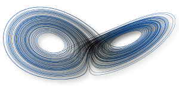
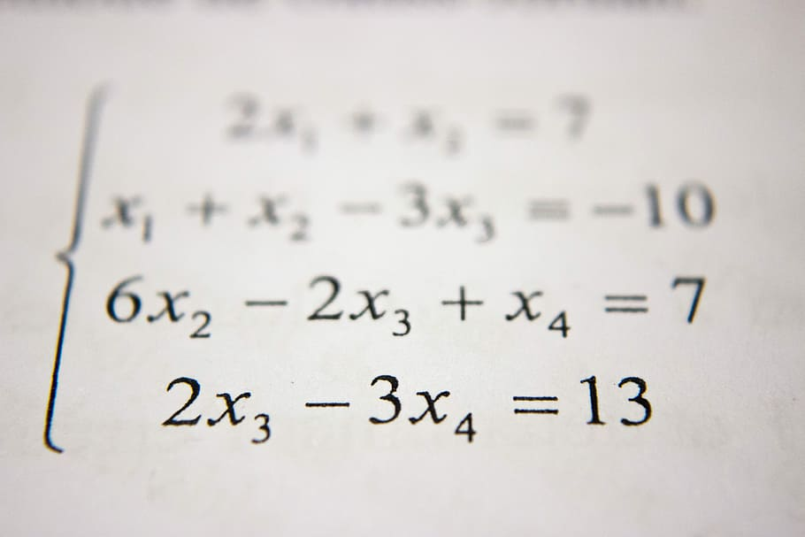
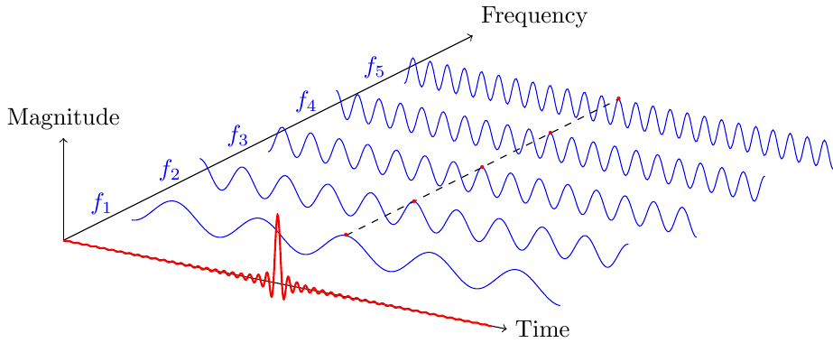

  

# Lecture notes and material

This repository contains all of the lecture notes and material for the different courses I teach at [Arts et Métier Institute of Technology](https://artsetmetiers.fr/en). Note that, rather than downloading or forking this whole repository, you can access each course through this [webpage](https://loiseaujc.github.io/teaching/) (in construction). If you have any questions or if you spot any errors, typos or broken links, please feel free to contact me at loiseau.jc@gmail.com or via the [Issue](https://github.com/loiseaujc/Teaching/issues) page.

## Table of contents

- [Introduction to nonlinear physics, dynamical systems and chaos theory](#introduction-%to-nonlinear-physics,-dynamical-systems-and-chaos-theory) (Arts et Métiers - Sorbonne Université, Master 2)
- [Basics of linear algebra and differential equations](#basics-of-linear-algebra-and-differential-equations) (Arts et Métiers, Master 1)
- [Data Analysis and Statistics for engineers](#fourier-analysis-and-signal-processing) (Arts et Métiers, Master 1)
- [Numerical methods in fluid dynamics](#numerical-methods-in-fluid-dynamics) (Arts et Métiers, Master 1)
- [Introduction au calcul scientific avec python](#introduction-to-scientific-computing-with-python) (Arts et Métiers, FIP)

---

## Introduction to nonlinear physics, dynamical systems and chaos theory

  

### Course description

This course is part of the master program [M2 Aérodynamique et Aéroacoustique](http://master.spi.sorbonne-universite.fr/fr/mecanique-des-fluides/m2-aerodynamique-et-aeroacoustique/liste_des_ue.html) proposed jointly by *Sorbonne Université* and *Arts et Métiers Institute of Technology*. Its aim is to give students an overview of the typical behaviours dynamical systems can exhibit (i.e. fixed points, periodic orbits, quasi-periodic dynamics and temporal chaos) and how to study them (e.g. fixed point computation, linear stability, bifurcation and normal form theory, Takens embedding theorem, etc). The course consists in fifteen sessions of two-hour long lectures with a few exercises. A small numerical project in `python` or `julia` on realistic systems from fluid dynamics or classical mechanics is also proposed.

### Prerequisite

- Course primarily intended for students with some background in physics, mechanics or applied mathematics.
- Basics of matrix calculus, Taylor series and differential equations.
- Prior knowledge of `python` or `julia` would be highly beneficial for the numerical project.

### Lesson plan

The course is divided in fifteen 2-hour long lectures. The lesson plan below may be subject to modifications as the course evolves pretty much every year when interacting with students. I will try to keep this `README` up to date every time the course is modified.

- Lecture 1: What are dynamical systems and how do we study them?
- Lecture 2 : First-order systems and elementary bifurcations.
- Lecture 3 : Second-order systems
- Lecture 4 : Oscillators
- Lecture 5 : Resonance and synchronization
- Lecture 6 : Lorenz system
- Lecture 7 : Unimodal maps
- Lecture 8 : A brief introduction to fractal geometry
- Lecture 9 : Strange attractors
- Lecture 10 : Cellular automata
- Lecture 11 : Data-driven methods for dynamical systems
- Lecture 12 : Data-driven methods -- Attractor reconstruction
- Lecture 13 : Data-driven methods -- Dimensionality reduction
- Lecture 14 : Data-driven methods -- System identification
- Lecture 15 : Some research examples

### Recommended reading

- Steven Strogatz. [*Nonlinear dynamics and chaos*](http://www.stevenstrogatz.com/books/nonlinear-dynamics-and-chaos-with-applications-to-physics-biology-chemistry-and-engineering) (English only).
- James Gleick. [*Chaos: Making a new science*](https://www.amazon.com/Chaos-Making-Science-James-Gleick/dp/0143113453) (English) or [*La théorie du chaos: vers une nouvelle science*](https://www.amazon.com/th%C3%A9orie-chaos-Vers-nouvelle-science/dp/2081218046) (French).
- Paul Manneville. [*Instabilities, chaos and turbulence*](https://www.worldscientific.com/worldscibooks/10.1142/p642) (English) or [*Instabilités, chaos et turbulence*](https://www.amazon.fr/Instabilit%C3%A9s-chaos-turbulence-Paul-Manneville/dp/2730209131) (French).

### Additional resources

- P. Cvitanovic. [Chaos book](http://chaosbook.org/).

---

## Mathematics for Engineers

  

### Course description

This course is part of the international master program [Factory of the future](https://artsetmetiers.fr/en/mecanique-energie-et-ingenierie) proposed by *Arts et Métiers Institute of Technology*. Note that students enrolling in this program may come from very different backgrounds. The course thus emphasizes on linear time-invariant dynamical systems to illustrate various mathematical tools of utmost importance in engineering such as eigenvalue and singular value analysis, the least-squares and least-norm methods or convex optimization. One or two small numerical projects in `python` or `octave` are also proposed.

### Prerequisite

- Basic mathematics (e.g. derivative and integrals, complex numbers, etc).
- Prior knowledge of `python`, `octave` or `matlab` would be beneficial.

### Lesson plan

The course is divided in fifteen 2-hour long lectures. The lesson plan below may be subject to modifications as the course evolves pretty much every year when interacting with students. I will try to keep this `README` up to date every time the course is modified.

- Lecture 1: ...

### Recommended reading

- J. Nathan Kutz. [Data-driven modeling & scientific computing: methods for complex systems and big data](https://www.amazon.com/Data-Driven-Modeling-Scientific-Computation-Methods/dp/0199660344).

---

## Data analysis & Statistics for Engineers

  

### Course description

This short course is part of the international master program [Factory of the future](https://artsetmetiers.fr/en/mecanique-energie-et-ingenierie) proposed by *Arts et Métiers Institute of Technology*. Note that students enrolling in this program may come from very different backgrounds.

### Prerequisite

- 

### Lesson plan

The course is divided in six 2-hour long lectures. The lesson plan below may be subject to modifications as the course evolves pretty much every year when interacting with students. I will try to keep this `README` up to date every time the course is modified.

- Lecture 1: ...

### Recommended reading

- TBA

### Additional resources

- [SciPy lectures](https://scipy-lectures.org/)
- [3Blue1Brown : But what is the Fourier transform?](https://www.youtube.com/watch?v=spUNpyF58BY)

---

## Numerical methods in fluid dynamics

### Course description

This short course is part of the international master program [Factory of the future](https://artsetmetiers.fr/en/mecanique-energie-et-ingenierie) proposed by *Arts et Métiers Institute of Technology*. This course is not mandatory. Hence, having only a handful of students enrolling each year, it consists in a series of hands-on tutorials rather than dedicated lectures. The aim is that, by the end of the course, students are able to implement in `python` a simple two-dimensional Navier-Stokes solver based on pseudospectral methods for two-dimensional turbulence in a doubly periodic domain.

### Prerequisite

- Basic mathematics (e.g. derivative and integrals, complex numbers, Fourier analysis).
- Prior knowledge of `python`, `octave` or `matlab` would be beneficial.

### Lesson plan

This course consists in a series of tutorials.

- Tutorial 1: Solving the stationary heat equation.
- Tutorial 2: Solving the one-dimensional linear advection-diffusion equation in a periodic domain.
- Tutorial 3: Solving the one-dimensional Burger's equation in a periodic domain.
- Tutorial 4: Towards a Navier-Stokes solver for two-dimensional turbulence in a doubly periodic domain.

### Recommended reading

- TBA

### Additional resources

- [SciPy lectures](https://scipy-lectures.org/)
- [12 steps to Navier-Stokes](https://github.com/barbagroup/CFDPython) by L. Barba.

---

## Introduction to scientific computing with python

### Course description

This short course is part of the program FIP proposed by *Arts et Métiers Institute of Technology*. Its aim is to introduce students to scientific computing with `python`. Because the audience consists mostly of engineering students spending half of their time in industry, the idea is to have quite practical hands-on sessions rather than a lengthy course about scientific computing.

### Prerequisite

- Basic mathematics (e.g. matrix and vector calculus, derivative)

### Lesson plan

The course consists in five lectures of 1.5 hours each followed by hands-on sessions of 1.5 hour as well. Each course focuses on one specific concept and illustrates it on a real-life engineering example.

- Lecture 1 : Introduction to `python` and `numpy`

- Lecture 2 : Root findings methods for univariate functions

- Lecture 3 : Linear and non-linear algebraic systems of equations

- Lecture 4 : Interpolation

- Lecture 5 : Differential equations

### Recommended reading

- 

### Additional resources

- [SciPy lectures](https://scipy-lectures.org/)

---

## License 

This work is distributed under the [Creative Commons BY-NC-SA 4.0](https://creativecommons.org/licenses/by-nc-sa/4.0/) license.
See `LICENSE.markdown` for more details.
